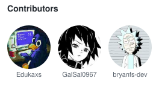

# ⚔️ Convictus

Convictus is a browser-based battle game developed in PHP, focused on applying Object-Oriented Programming (OOP) concepts, database integration, and turn-based battle systems.

The project was developed as an academic project for a Systems Development course.

---

## 🎮 About the Project

Convictus is a dungeon-style battle game where the player controls a team of characters and faces a team of enemies.

The current system includes:

- Character system
- Attack system
- Teams with up to 3 characters
- Turn-based battles
- HP system
- Dead character detection
- Basic enemy AI
- Battle persistence using PHP sessions
- Database integration for characters and attacks
- Pixel-art-inspired battle interface
- Main menu
- Separate player and enemy sprites

---

## 🧱 Technologies Used

Technology| Purpose
PHP| Game logic and backend
MySQL/MariaDB| Database
HTML| Page structure
CSS| Interface and styling
XAMPP| Local development environment
PDO| Database connection

---

## 🧠 Object-Oriented Programming

The project uses OOP to organize the main game systems.

Main Classes

"Personagem"

Represents a character in the game.

It stores information such as:

- ID
- Name
- Sprite
- Maximum HP
- Current HP

It also provides methods to:

- Take damage
- Recover health
- Check whether the character is alive
- Retrieve character information

---

"Ataque"

Represents an attack that can be used during a battle.

An attack contains information such as:

- ID
- Name
- Damage

The class is also responsible for executing the attack against a target character.

---

"Equipe"

Represents a team of characters.

A team can contain up to three characters and provides methods to:

- Add characters
- Retrieve characters
- Find the first living character
- Check whether the team still has living characters

---

"Batalha"

This is the main class responsible for the combat system.

It controls:

- Player team
- Enemy team
- Current turn
- Character whose turn it is
- Attack execution
- Turn progression
- Victory and defeat conditions
- Enemy turns

The current turn order is:

```text
Turn 0 → Player 1
Turn 1 → Player 2
Turn 2 → Player 3

Turn 3 → Enemy 1
Turn 4 → Enemy 2
Turn 5 → Enemy 3
```

After turn 5, the system returns to turn 0.

---

## 🗄️ Database

The game uses a database to store character and attack information.

"personagem"

Stores character information.

Example:

id
nome
sprite
hp_max

"ataque"

Stores the attacks available to characters.

Example:

id
personagem_id
nome
dano

The relationship between the tables allows each character to have their own attacks.

---

## 📂 Project Structure

The main project structure is:

```text
Jogo Convictus/
│
├── classes/
│   ├── Personagem.php
│   ├── PersonagemRepository.php
│   ├── Ataque.php
│   ├── AtaqueRepository.php
│   ├── Equipe.php
│   └── Batalha.php
│
├── config/
│   └── conexao.php
│
├── dungeon/
│   └── batalha.php
│
├── img/
│   ├── personagens/
│   └── inimigos/
│
├── css/
│   ├── dungeon.css
│   └── index.css
│
└── index.php
```

---

## 🔌 Repositories

The project uses Repository classes to handle communication between the game classes and the database.

"PersonagemRepository"

Responsible for retrieving characters from the database.

For example:

$personagemRepository->buscarPorId(1);

The method queries the database and converts the retrieved data into a "Personagem" object.

"AtaqueRepository"

Responsible for retrieving attacks associated with characters from the database.

This separation keeps SQL queries outside the main game pages and helps organize the application.

---

## 💾 Session System

During a battle, the current game state is stored using PHP sessions.

The session stores information such as:

- Current turn
- Player character HP
- Enemy character HP

This allows the player to reload the page without immediately losing the current battle state.

The battle also has a:

Restart Battle

option that removes the battle data from the session and starts a new battle.

---

## ⚔️ Battle System

The battle works through a turn-based system.

When it is the player's turn, the available attacks are displayed at the bottom of the screen.

When an attack is selected:

1. The system identifies the current character.
2. It identifies the selected attack.
3. The attack is executed.
4. The damage is calculated.
5. The target's HP is reduced.
6. The turn advances.
7. The current battle state is saved to the session.

When an enemy's turn begins, the enemy AI automatically performs an attack.

---

## 🤖 Enemy AI

The enemies use a basic AI system.

During an enemy turn, the system:

1. Identifies the current enemy.
2. Finds a living player character.
3. Selects an available attack.
4. Executes the attack.
5. Applies the damage.
6. Advances to the next turn.

The goal is to provide functional enemy behavior while keeping the system simple enough for the project's initial version.

---

## 🎨 Interface

The battle interface was developed using HTML and CSS.

The screen is divided into three main areas:

Top Area

Displays:

- Player character HP
- Enemy HP
- Character whose turn it is

Battle Arena

Displays the characters from both teams.

Player characters are positioned on the left side, while enemies are positioned on the right side. Enemy sprites are horizontally flipped so that they face the player's team.

Bottom Panel

Contains:

- Battle messages
- Attack buttons
- Battle restart option

---

## 🖥️ How to Run

The project was developed using XAMPP.

1. Start XAMPP

Start:

Apache
MySQL

2. Place the Project in "htdocs"

For example:

C:\xampp\htdocs\Jogo Convictus

3. Configure the Database

The database must be created in MySQL/MariaDB and the connection information must be configured in:

config/conexao.php

4. Open the Game

Open the following address in your browser:

http://localhost/Jogo%20Convictus/

The main page provides access to the dungeon.

---

## 🧪 Testing

Several tests were performed during development to verify the individual systems before integrating them into the final interface.

Tests included:

- Database connection test
- Character test
- Attack test
- Team test
- Battle test
- Damage test
- Dead character test
- Turn progression test
- Enemy AI test
- Battle session persistence test

---

## 🚧 Future Development

The project can be expanded with additional features in the future, such as:

- Multiple battle scenarios
- Different dungeons
- New enemy types
- More playable characters
- More attacks
- Attack animations
- Visual effects
- Target selection
- Character progression
- More elaborate victory and defeat systems
- Multiple stages

These features were intentionally left for future development so that the initial version could focus on implementing the core game systems.

---

## 📌 Project Status

Functional Academic Version

The project currently contains the core systems required for a functional browser-based battle game using PHP, a database, and Object-Oriented Programming.


## Team

Project collaboratively developed by the members of **CHEB-Labs**, a group of students from **ETEC da Zona Leste (ETEC ZL)**.



The contributions listed above may be updated as the project progresses.
